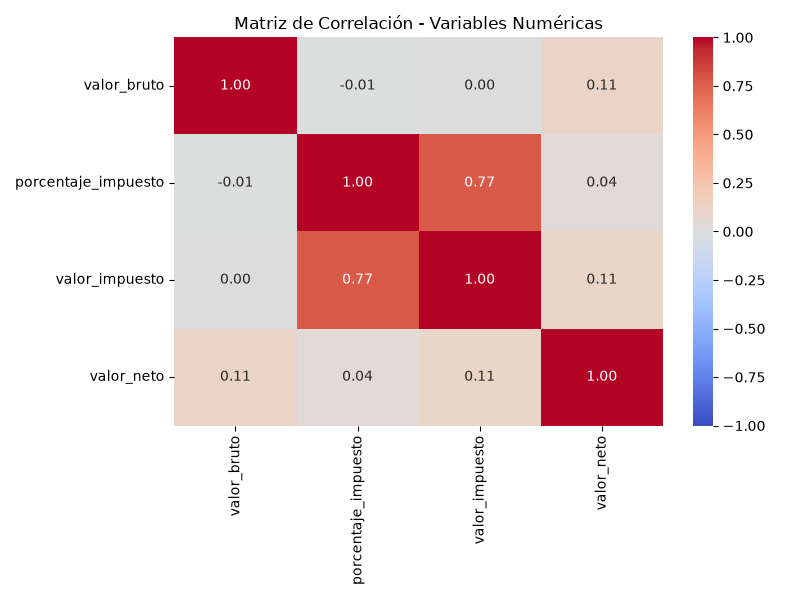
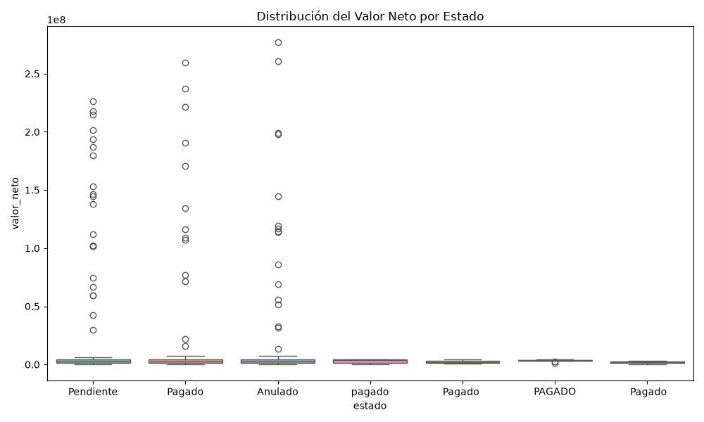
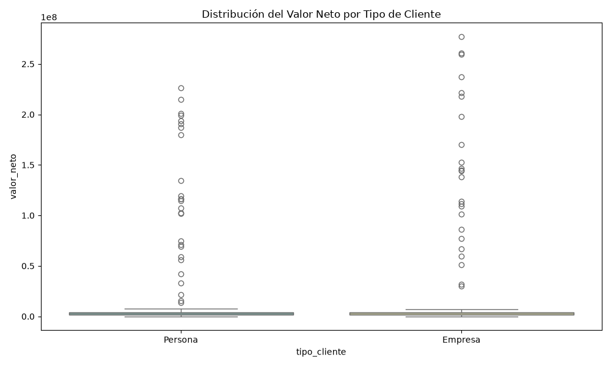
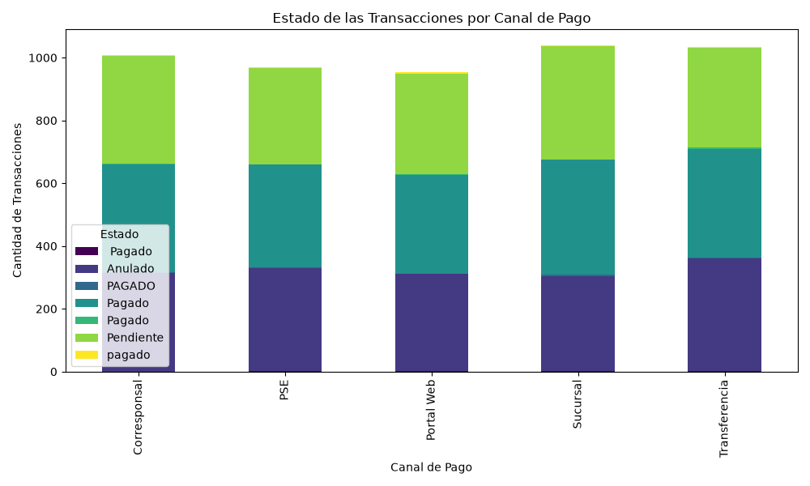

# Análisis Exploratorio de Datos

Este reporte presenta los resultados del EDA bivariante y multivariante, realizado a partir de la base de datos procesada. Todas las visualizaciones fueron generadas mediante un script automatizado en Python (`src/eda_analysis.py`).

---

## 1. Análisis Bivariante: Numérica vs Numérica
**Objetivo:** Entender la correlación lineal entre las métricas financieras clave.



**Hallazgos principales:**
- Se observa una correlación natural y directa entre el `valor_bruto`, `valor_impuesto` y `valor_neto`. 
- El `porcentaje_impuesto` no muestra una correlación perfectamente lineal de +1 con los montos absolutos debido a la variación de las tasas aplicadas probablemente debido a exenciones o diferentes tipos de servicios.

---

## 2. Análisis Bivariante: Categórica vs Numérica
**Objetivo:** Evaluar la dispersión del valor monetario (`valor_neto`) cruzado con dimensiones categóricas como estado y tipo de cliente.

### A. Valor Neto por Estado


> [!WARNING]
> **Hallazgo Crítico de Calidad de Datos:** 
> Al observar el eje X del Boxplot y analizando las tablas de contingencia detectamos un **problema de estandarización en la columna `estado`**. Existen múltiples variaciones para el mismo concepto debido a espacios en blanco y diferencias en mayúsculas/minúsculas:
> - `Pagado`
> - `PAGADO`
> - `pagado`
> - `Pagado ` (tiene un espacio al final)
> 
> **Recomendación para la fase final del ETL:** Aplicar funciones `.str.strip().str.capitalize()` en Python antes de construir el Dashboard final.

### B. Valor Neto por Tipo de Cliente


**Hallazgos principales:**
- La distribución y los valores atípicos nos permiten identificar a los clientes corporativos vs. personas naturales, o visualizar si existe un sesgo en los montos de facturación hacia algún grupo en particular.

---

## 3. Análisis Bivariante: Categórica vs Categórica
**Objetivo:** Entender el comportamiento transaccional cruzando canales de atención y el estado final del pago.

### Tabla de Contingencia y Gráfico de Barras Apiladas


**Tabla de resumen rápido (Después de aplicar la estandarización en el ETL):**
```text
estado         Anulado  Pagado  Pendiente
canal_pago                               
Corresponsal       315     349        343
PSE                327     335        307
Portal Web         310     323        320
Sucursal           304     372        362
Transferencia      360     354        319
```

**Conclusión:**
Los canales de pago PSE, Sucursal, Portal Web, tienen un volumen de uso equitativo. Gracias a que **identificamos y corregimos el problema de calidad de datos en la variable `estado` durante el ETL**, ahora la tabla de contingencia es 100% precisa. Este EDA sirvió como un filtro de calidad avanzado y nos garantiza que el modelo de Power BI que conectemos recibirá datos perfectamente estandarizados.
