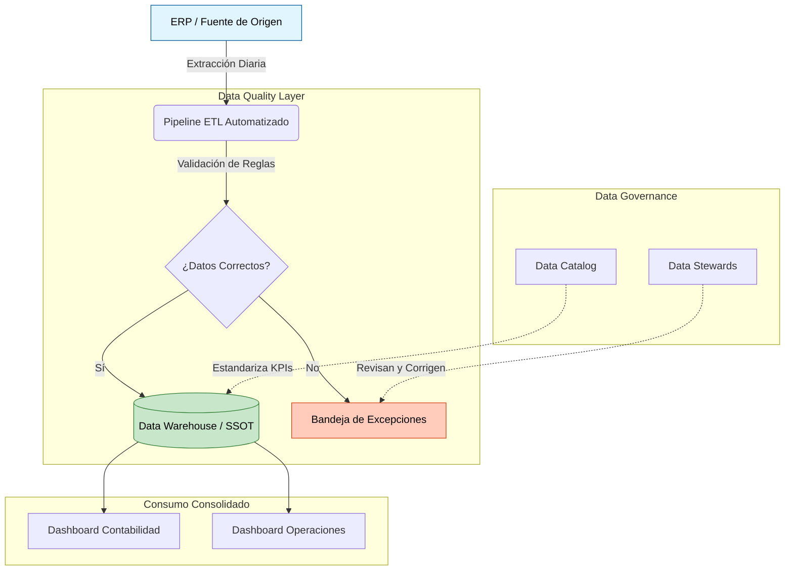

# Resolución del Caso de Negocio: Discrepancia de Reportes sobre Data Governance en Cloud

## Contexto del Problema
**Situación:** Al final del mes, el área de Contabilidad y el área de Operaciones presentan reportes de ingresos totales que no cuadran entre sí. Ambos equipos extraen la información del mismo ERP original, pero la procesan de manera distinta, esto causa que los equipos tengan problemas con la consolidacion de la informacion generando conflictos de gobernanza de datos. 

Este es un problema de **Silos de Datos** y falta de gobernanza, el cual genera desconfianza en la información, retrasos en la toma de decisiones gerenciales y posibles riesgos de auditoría.

## ¿Por qué ocurre la discrepancia? |Identificacion de los actores
Basado en las mejores prácticas de ingeniería de datos, las discrepancias suelen originarse por:
*   **Definiciones de Negocio Diferentes:** Operaciones puede estar midiendo el ingreso Bruto que cuando apenas se hace la transacción, mientras que Contabilidad mide el ingreso Neto que es después de impuestos y devoluciones.
*   **Cortes de Tiempo:** Un equipo puede filtrar por `fecha_transaccion` y el otro por `fecha_contabilizacion`.
*   **Manejo de Excepciones y falta de comunicación:** Un equipo elimina las transacciones con errores nulos o duplicados en su Excel manual, mientras que el otro las incluye asumiendo que se corregirán después.

Igualmente, no contar con herramientas de auditoría o gobernanza de datos puede traer graves consecuencias para las organizaciones, como la pérdida de confianza en los datos, la pérdida de tiempo y dinero debido a la necesidad de volver a procesar los datos, y la imposibilidad de cumplir con los requisitos regulatorios.

## Propuesta de Solución de arquitectura. 
Para resolver este problema de raíz y modernizar la infraestructura de los datos, propongo migrar hacia un ecosistema de **Gobierno de Datos en la Nube** Ej. Google Cloud Platform, Azure o AWS, estructurado en 4 pilares:

### 1: Fuente Única de Verdad SSOT. | definición clara del dato o indicador, criterios para la fuente del dato.
*   **Implementación:** Un sistema donde se prohíbe la extracción directa y manual de datos crudos desde el ERP hacia hojas de cálculo individuales.
*   **Resultado:** Se construye un Data Lakehouse o Data Warehouse en la Nube Ej. Google BigQuery o Snowflake. Todos los tableros de Power BI y reportes, tanto para Contabilidad como para Operaciones, deben conectarse obligatoriamente a esta única base de datos certificada, que seria el equivalente a la tabla `transacciones` que limpié en la Parte 1. De esta manera se elimina la incertidumbre sobre la información, ya que todos los departamentos consumen la misma información, lo que permite una mayor transparencia y confianza en los datos. 

### 2: Catálogo de Datos | reglas mínimas de negocio y calidad.
*   **Implementación:** Implementar un diccionario de datos vivo con herramientas como Google Cloud Data Catalog o Microsoft Purview. 
*   **Resultado:** Se estandariza el vocabulario a nivel corporativo. Si un KPI dice "Ingresos Totales", el catálogo define mediante una fórmula matemática aprobada qué columnas se suman y qué estados (`Pagado`) se incluyen, evitando que cada área invente su propio cálculo. Esto aplica para que no hayan mal entendidos en el futuro respecto a los indicadores puesto que por lo general las diferentes areas manejan diferentes procesos, entienden de forma distinta la informacion, Al final estandarizar es la forma mas adecuada de manejar las mismas convenciones.

### 3: Orquestación y Pipeline de Excepciones Automatizado |controles y mecanismos de seguimiento.
*   **Implementación:** Desplegar un pipeline ETL en la nube con Apache Airflow / Cloud Composer o dbt, idéntico a la lógica que construí en el script de Python.
*   **Resultado:** Las transacciones con errores críticos como colisiones de ID o sin fechas, seran automáticamente desviadas a una Bandeja de Excepciones antes de entrar al Data Warehouse. Así, ningún reporte mostrará datos erroneos, garantizando que los datos visibles sean exactos y auditables. Esta bandeja de excepciones solo cumplira su proposito si hay supervisión humana para corregir los datos corruptos, es indispensable que exista esta revision por temas de confiabilidad de la informacion e integridad del proceso contable.
 
### 4: Asignación de Data Stewards | información documentada para garantizar calidad de datos y procesos a lo largo del tiempo.
*   **Implementacion:** La tecnología por sí sola no arregla el gobierno corporativo. Se debe nombrar a un Data Steward en Contabilidad y otro en Operaciones, estos se encargaran de revisar la documentacion de los datos en lo pilares anteriores.
*   **Resultado:** Serán los responsables de revisar diariamente el Dashboard de Calidad de Datos para corregir en el sistema origen las transacciones que el pipeline aisló en cuarentena. Este apartado es crucial ya que las herramientas no son infalibles y siempre existirán excepciones que deben ser revisadas por un humano. Ademas en sistemas contables nunca es buena idea eliminar automaticamente datos relacionados con transacciones, debe haber supervision humana para hacer trazabilidad de los posibles datos corruptos, esto con el fin de garantizar un modelo de funcionamiento limpio para evitar retrocesos en el área administrativa

## Conclusión y Valor Gerencial
Adoptar esta estrategia Cloud elimina las incertidumbre. Cuando Gerencia Financiera pregunte "¿Cuánto vendimos?", habrá un único número respaldado por reglas de calidad automatizadas, reduciendo el trabajo manual repetitivo y protegiendo el capital de la compañía contra errores humanos. Considero que las acciones implementadas estan bien orientadas para resolver este tipo de problemas, no obstante es importante tener en cuenta que el componente humano y organizacional es tan importante como el tecnológico, por lo que es crucial asignar responsabilidades claras y asegurar la colaboración entre los equipos para garantizar el éxito de la solución implementada. 
La implementacion de un gobierno de datos en la nube es una inversion estrategica que permite tomar decisiones informadas, reducir riesgos y mejorar la eficiencia operativa, lo que se traduce en un mayor valor para la compañía. De esta manera puedo decir que se resuelve el problema de fondo del por que los equipos tienen discrepancias en los reportes, puesto que ahora se tiene una fuente unica de verdad y un proceso claro para el manejo de excepciones.

